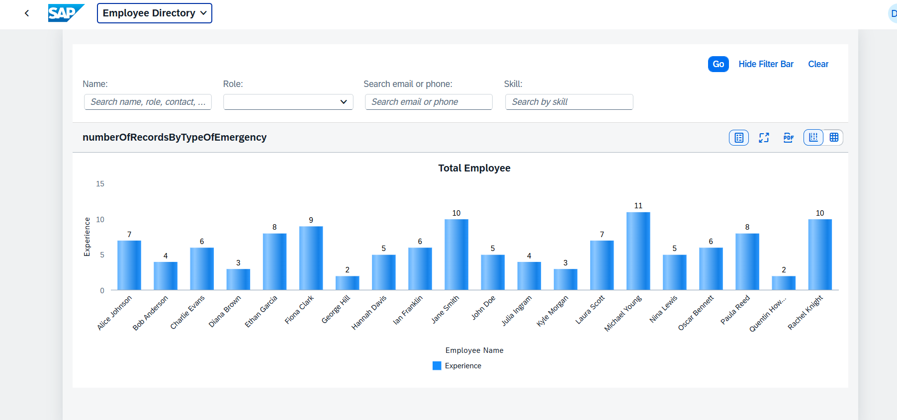
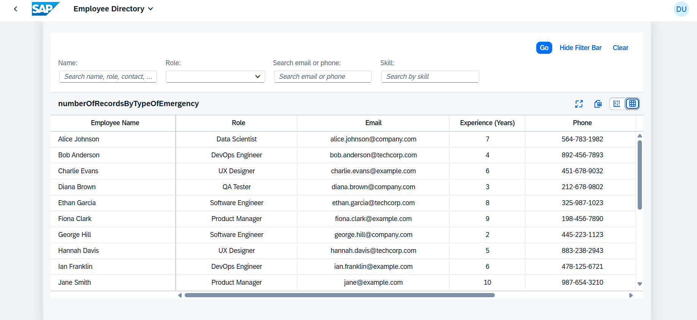
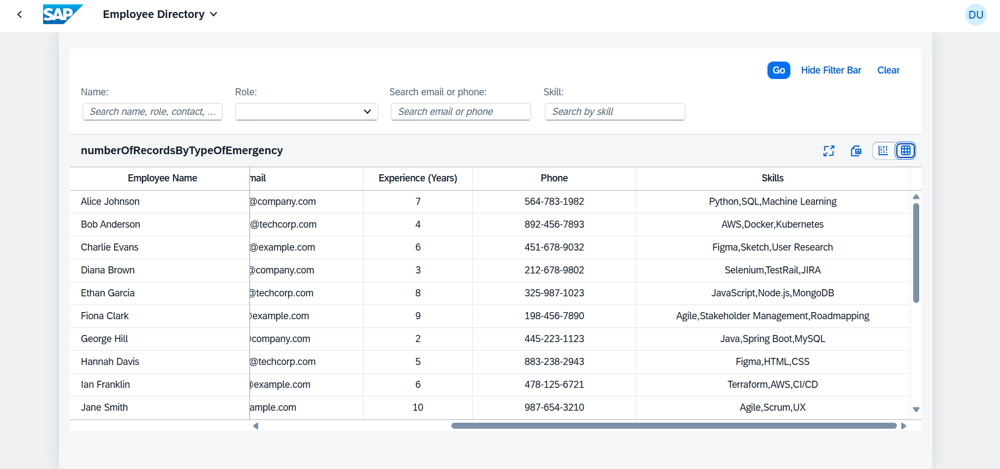

# 👨‍💼 Employee Directory Application (SAPUI5)

A responsive Single Page Application built with **SAPUI5**, using JSON Models and XML Views. It provides full control to view and filter employees with smart search, role filtering, and skill insights.

---

## 🚀 Features

- 🔍 **Global Search** across name, role, contact, and skills
- 🎯 **Role-based Filtering** using dropdown with key-text mapping
- 🧑‍🤝‍🧑 **Skill Matching & Filtering** to find collaborators
- 📧 **Contact Lookup** via phone and email
- 🧠 **AI-style profile summaries** (UI-driven insights)
- 📤 Export employee data to CSV (manual or via PapaParse in hybrid app)
- 📊 Dynamic SAPUI5 Table with:
  - Expandable name column
  - Column sorting and data binding
- 💡 Uses `FilterBar`, `FilterGroupItem`, `Input`, `Select`, `Table`, `JSONModel`

---

## 🧰 Tech Stack

- **SAPUI5 (OpenUI5)** – XML Views, Controllers, JSON Models
- **UI5 Controls** – `Table`, `FilterBar`, `Select`, `ExpandableText`
- **JSON Data** – Local employee and role datasets
- **No build needed** – Pure client-side, ready to run

---

## Screenshots

